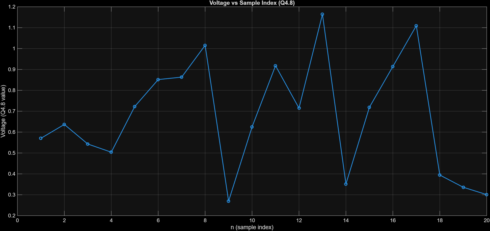
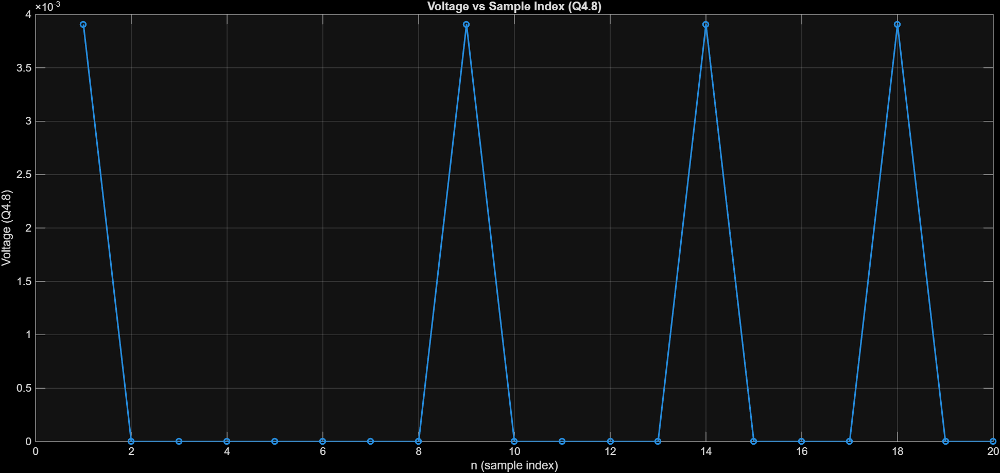

# CA1: Leaky Integrate-and-Fire (LIF) Spiking Neuron — Hardware Implementation 🧠⚡

A fully structural, register-transfer level (RTL) implementation of a **Leaky Integrate-and-Fire (LIF)** spiking neuron model in **SystemVerilog**, designed with a single shared ALU control-datapath architecture, verified with ModelSim, and validated against MATLAB reference plots.

> 👤 **Authors:** Amirali Dehghani (`810102443`) · Nazhin Nikkhahbahrami (`810102530`)  
> 🎓 **Course:** Computer Architecture — Fall 1404 (2025–2026)  
> 🏫 **University:** University of Tehran  
> 📄 **Handwritten Schematic & FSM Reference:** [CA01-810102443-810102530.pdf](CA01-810102443-810102530.pdf)  
> 📋 **Assignment Specification:** [CA#01.pdf](CA%2301.pdf)

---

## 📑 Table of Contents

- [CA1: Leaky Integrate-and-Fire (LIF) Spiking Neuron — Hardware Implementation 🧠⚡](#ca1-leaky-integrate-and-fire-lif-spiking-neuron--hardware-implementation-)
  - [📑 Table of Contents](#-table-of-contents)
  - [📖 Overview \& Background](#-overview--background)
  - [🧮 Mathematical Formulation](#-mathematical-formulation)
    - [1. Continuous-Time LIF Model](#1-continuous-time-lif-model)
    - [2. Discrete-Time Discretization (Euler Method)](#2-discrete-time-discretization-euler-method)
    - [3. Q4.8 Fixed-Point Number System](#3-q48-fixed-point-number-system)
  - [🏗️ System Architecture](#️-system-architecture)
    - [Top-Level Interface](#top-level-interface)
      - [Signal Description](#signal-description)
    - [Hardware Structural Schematic](#hardware-structural-schematic)
  - [🗜️ Datapath Implementation](#️-datapath-implementation)
    - [Datapath Components](#datapath-components)
    - [Register Map](#register-map)
    - [ALU Operation Table](#alu-operation-table)
    - [ROM Synaptic Weights (`Weights.mif`)](#rom-synaptic-weights-weightsmif)
  - [🕹️ Controller (FSM) Design](#️-controller-fsm-design)
    - [State Diagram \& State Encodings](#state-diagram--state-encodings)
    - [State-by-State Control Matrix](#state-by-state-control-matrix)
  - [🧪 Simulation \& Verification](#-simulation--verification)
    - [Testbench Flow](#testbench-flow)
    - [20-Timestep Simulation Results](#20-timestep-simulation-results)
    - [MATLAB Visualization \& Plots](#matlab-visualization--plots)
      - [Figure 1: Membrane Voltage ($V\[n\]$) vs. Sample Index](#figure-1-membrane-voltage-vn-vs-sample-index)
      - [Figure 2: Output Spike Train vs. Sample Index](#figure-2-output-spike-train-vs-sample-index)
  - [📐 Compliance with Design Constraints](#-compliance-with-design-constraints)
  - [📂 Directory Structure](#-directory-structure)

---

## 📖 Overview & Background

Biological neural networks process information through discrete electrical pulses called **spikes**. Spiking Neural Networks (SNNs) replicate this bio-inspired paradigm to achieve high energy efficiency and real-time processing capabilities in neuromorphic hardware.

The **Leaky Integrate-and-Fire (LIF)** neuron is one of the most widely used mathematical models for simulating biological neurons. It models the cell membrane as a parallel resistor-capacitor ($RC$) circuit:
1. **Integrate:** Accumulates incoming weighted synaptic currents ($I[n]$) into the membrane potential ($V[n]$).
2. **Leak:** Gradually decays the membrane potential towards a resting potential ($V_{rest}$) over time.
3. **Fire & Reset:** Emits an output spike ($S[n]=1$) when the membrane potential reaches or exceeds a threshold voltage ($V_{th}$), and immediately resets the potential back to $V_{rest}$.

This project implements a hardware-efficient LIF spiking neuron with **8 input synapses** using SystemVerilog, adhering strictly to RTL design constraints including a single shared ALU, zero hardware multipliers, and a 19-state Finite State Machine (FSM).

---

## 🧮 Mathematical Formulation

### 1. Continuous-Time LIF Model

The differential equation governing the membrane potential $V(t)$ in a continuous domain is given by:

$$\tau_m \frac{dV(t)}{dt} = -(V(t) - V_{rest}) + R_m I(t)$$

When $V(t) \ge V_{th}$, the neuron fires a spike and resets:

$$V(t) \to V_{rest}, \quad \text{Spike Output} = 1$$

### 2. Discrete-Time Discretization (Euler Method)

Applying Forward Euler discretization with timestep $\Delta t$:

$$\frac{V[n+1] - V[n]}{\Delta t} = \frac{-(V[n] - V_{rest}) + R_m I[n]}{\tau_m}$$

Multiplying by $\Delta t$ and defining parameters $\alpha = \frac{\Delta t}{\tau_m}$ and $\beta = \alpha R_m$:

$$V[n+1] = V[n](1 - \alpha) + \alpha V_{rest} + \beta I[n]$$

Per project specifications:
- $\alpha = 0.25 = 2^{-2}$
- $\beta = 1$

Thus, multiplication by $\alpha = 0.25$ simplifies to a **2-bit arithmetic right shift** (`>>> 2`), avoiding costly hardware multipliers:

$$V[n+1] = V[n] - (V[n] \gg 2) + (V_{rest} \gg 2) + I[n]$$

Where the total input current $I[n]$ is the sum of weighted active input spikes:

$$I[n] = \sum_{k=0}^{7} W_k \cdot S_k[n]$$

Firing and reset conditions:

$$\text{If } V[n+1] \ge V_{th} \implies S[n+1] = 1, \quad V[n+1] = V_{rest}$$
$$\text{Else } \implies S[n+1] = 0, \quad V[n+1] = V[n+1]$$

---

### 3. Q4.8 Fixed-Point Number System

To maintain high precision without floating-point units, all voltages ($V[n], V_{rest}, V_{th}$), currents, and weights use a **12-bit signed Q4.8 fixed-point format**:

$$\text{Format: } \underbrace{\text{S}}_{\text{1 bit}} \ \underbrace{\text{INT}}_{\text{3 bits}} \ \cdot \ \underbrace{\text{FRAC}}_{\text{8 bits}}$$

- **Total Width:** 12 bits
- **Integer Part:** 4 bits (signed 2's complement, range $-8$ to $+7.99609375$)
- **Fractional Part:** 8 bits
- **Resolution:** $2^{-8} = \frac{1}{256} \approx 0.00390625$
- **Conversion Formula:**
  $$\text{Real Value} = \frac{\text{Signed Integer Value}}{256}$$

---

## 🏗️ System Architecture

### Top-Level Interface

The top module [LIF.sv](LIF.sv) connects the controller ([controller.sv](controller.sv)) and datapath ([datapath.sv](datapath.sv)):

```
                       ┌─────────────────────────────────────────┐
                       │               LIF (Top Module)          │
                       │                                         │
  clk ────────────────►│   ┌──────────────┐    ┌─────────────┐   │
  rst ────────────────►│   │              │    │             │   │
  start ──────────────►│   │  Controller  │───►│  Datapath   │───┼─► spike_out
  input_spikes[7:0] ──►│   │    (FSM)     │◄───│             │───┼─► valid
  Vth_en, Vth[11:0] ──►│   └──────────────┘    └─────────────┘   │
 Vrest_en, Vrest[11:0]►│                                         │
                       └─────────────────────────────────────────┘
```

#### Signal Description

| Signal | Type | Width | Description |
|---|---|---|---|
| `clk` | Input | 1-bit | System clock signal |
| `rst` | Input | 1-bit | Active-high asynchronous reset |
| `start` | Input | 1-bit | Pulse input to initiate dynamic step computation |
| `input_spikes` | Input | 8-bit | Input spike vector from 8 presynaptic neurons |
| `Vth_en` | Input | 1-bit | Enable signal to latch custom threshold potential |
| `Vth` | Input | 12-bit | Threshold potential (signed Q4.8) |
| `Vrest_en` | Input | 1-bit | Enable signal to latch custom resting potential |
| `Vrest` | Input | 12-bit | Resting potential (signed Q4.8) |
| `spike_out` | Output | 1-bit | Output spike signal (1 if neuron fires, 0 otherwise) |
| `valid` | Output | 1-bit | Active-high ready/valid signal indicating state idle |

---

### Hardware Structural Schematic

The physical hardware structure designed on Page 1 of [CA01-810102443-810102530.pdf](CA01-810102443-810102530.pdf) is structured as follows:

```
                  ┌─────────────────────────────────────────────────────────┐
                  │                 DATAPATH SCHEMATIC                      │
                  └─────────────────────────────────────────────────────────┘

                     inc ────►┌───────────────┐
                init_counter─►│ Counter (3b)  ├───► i[2:0] ─────┐
                              └───────┬───────┘                 │
                                      │ co                      ▼
                                      ▼                   ┌───────────┐
  ld_w ──────────────────────────────────────────────────►│ ROM (8x12)│
                                                          └─────┬─────┘
                                                                │ w[11:0]
                                                                ▼
   ┌───────────┐     ┌───────────┐     ┌───────────┐     ┌─────────────┐
   │ V-n Reg   │     │ V-rest Reg│     │ V-th Reg  │     │ I-n Reg     │
   │  (12-bit) │     │  (12-bit) │     │  (12-bit) │     │  (12-bit)   │
   └─────┬─────┘     └─────┬─────┘     └─────┬─────┘     └──────┬──────┘
         │                 │                 │                  │
         │                 ├────────┐        │                  │
         │                 │        │        │                  │
         ▼                 ▼        ▼        ▼                  ▼
   ┌───────────────────────────┐  ┌────────────────────────────────┐
   │       MUX 1 (4-to-1)      │  │        MUX 2 (4-to-1)          │
   │  sel: sel_v_n_1 / v_rest  │  │  sel: sel_v_n_2 / v_th / i_n   │
   └─────────────┬─────────────┘  └────────────────┬───────────────┘
                 │ Operand A                       │ Operand B
                 └────────────────┬────────────────┘
                                  ▼
                        ┌───────────────────┐
                        │   ALU12 (12-bit)  │◄── sel_alu (Add, Sub, Shift, Compare)
                        └─────────┬─────────┘
                                  │ aluOutput[11:0]
                                  ▼
                        ┌───────────────────┐
                        │ aluOut Reg (12b)  ├───► aluOut[11:0]
                        └─────────┬─────────┘     (feeds back to MUXes & Registers)
                                  │ aluOut[0]
                                  ▼
                        ┌───────────────────┐
                        │  Spike-out FF     ├───► spike_out
                        └───────────────────┘
```

---

## 🗜️ Datapath Implementation

### Datapath Components

The datapath ([datapath.sv](datapath.sv)) is constructed strictly out of modular RTL building blocks:

| Building Block | Module Name | Source File | Functionality |
|---|---|---|---|
| **12-bit Signed Reg** | `register_12` | [reg12.sv](reg12.sv) | 12-bit register with asynchronous reset, synchronous load (`ld`), and synchronous init (`init`) |
| **8-bit Spike Reg** | `register_8` | [reg8.sv](reg8.sv) | Holds input spike vector $S[7:0]$ |
| **D Flip-Flop** | `dff` | [dff.sv](dff.sv) | Latches internal spike state bit `out` |
| **3-bit Counter** | `counter_3` | [counter3.sv](counter3.sv) | Iterates synaptic index $i \in [0, 7]$, produces carry-out (`co`) when rollover occurs |
| **Synaptic Weight ROM** | `rom` | [rom.sv](rom.sv) | Synchronous $8 \times 12$-bit ROM storing Q4.8 synaptic weights loaded via `$readmemb` |
| **12-bit Signed ALU** | `alu12` | [alu.sv](alu.sv) | Single multi-function ALU executing Addition, Subtraction, Arithmetic Shift, and Comparison |
| **4-to-1 MUX (12-bit)** | `mux4to1` | [mux4to1.sv](mux4to1.sv) | 4-channel 12-bit multiplexer for routing data to ALU inputs and $V[n]$ register |
| **2-to-1 MUX (12-bit)** | `mux2to1` | [mux2to1.sv](mux2to1.sv) | 2-channel multiplexer |

---

### Register Map

| Register Name | Bit Width | Data Type | Initialization Value | Purpose |
|---|---|---|---|---|
| `v_n_reg` | 12-bit | Signed Q4.8 | `12'b0` | Holds current membrane potential $V[n]$ |
| `v_rest_reg` | 12-bit | Signed Q4.8 | `12'b0` | Holds baseline resting potential $V_{rest}$ |
| `v_th_reg` | 12-bit | Signed Q4.8 | `12'b0` | Holds threshold potential $V_{th}$ |
| `i_n_reg` | 12-bit | Signed Q4.8 | `12'b0` | Accumulates weighted sum of input current $I[n]$ |
| `aluOut_reg` | 12-bit | Signed Q4.8 | `12'b0` | Latches ALU intermediate computation results |
| `spike_reg` | 8-bit | Unsigned | `8'b0` | Latches input spike pattern |
| `spike_out_reg` | 1-bit | Logic | `1'b0` | Latches output spike status |
| `i_counter` | 3-bit | Unsigned | `3'b0` | 3-bit counter indexing synaptic weight ROM |

---

### ALU Operation Table

The arithmetic logic unit ([alu.sv](alu.sv)) uses a 2-bit control signal `sel_alu`:

| `sel_alu` | Operation | RTL Expression | Design Usage |
|---|---|---|---|
| `2'b00` | **ADD** | `result = A + B` | Voltage accumulation ($V[n] + I[n]$) & current sum |
| `2'b01` | **SUB** | `result = A - B` | Leakage calculation ($V[n] - V[n]/4$) |
| `2'b10` | **SHIFT** | `result = A >>> 2` | Arithmetic right shift by 2 ($\times 0.25$ decay factor) |
| `2'b11` | **COMPARE** | `result = (A >= B) ? 12'b1 : 12'b0` | Threshold evaluation ($V[n] \ge V_{th}$) |

---

### ROM Synaptic Weights (`Weights.mif`)

The ROM module loads weights from [Weights.mif](Weights.mif) at simulation startup:

| Index $i$ | Binary String | Q4.8 Hex | Decimal Value |
|---|---|---|---|
| **0** | `000000000110` | `0x006` | $+0.0234375$ |
| **1** | `000000011111` | `0x01F` | $+0.12109375$ |
| **2** | `000000000111` | `0x007` | $+0.02734375$ |
| **3** | `000000001100` | `0x00C` | $+0.0468750$ |
| **4** | `000000010001` | `0x011` | $+0.06640625$ |
| **5** | `000000101100` | `0x02C` | $+0.1718750$ |
| **6** | `000000100010` | `0x022` | $+0.1328125$ |
| **7** | `000000011100` | `0x01C` | $+0.1093750$ |

---

## 🕹️ Controller (FSM) Design

### State Diagram & State Encodings

The controller ([controller.sv](controller.sv)) follows a **19-state FSM Architecture** (Huffman style) corresponding directly to Page 2 of the handwritten report PDF:

```
                             ┌──────────┐
                ┌───────────►│ S0: IDLE │◄──────────────┐
                │            └────┬─────┘               │
                │                 │ start == 1          │
                │                 ▼                     │
                │            ┌──────────┐               │
                │            │ S1: LOAD │               │
                │            └────┬─────┘               │
                │                 │                     │
                │                 ▼                     │
                │            ┌──────────┐               │
                │            │ S2: COND │               │
                │            └────┬─────┘               │
                │                 │                     │
                │                 ▼                     │
                │       ┌──────────────────┐            │
                │       │ S3..S5: LEAKAGE  │            │
                │       └─────────┬────────┘            │
                │                 │                     │
                │                 ▼                     │
                │       ┌──────────────────┐            │
                │       │ S6..S8: REST ADD │            │
                │       └─────────┬────────┘            │
                │                 │                     │
                │                 ▼                     │
                │       ┌──────────────────┐            │
                │       │  S9: INIT LOOP   │            │
                │       └─────────┬────────┘            │
                │                 │                     │
                │                 ▼                     │
                │     ┌──────────────────────┐          │
                │ ┌───│ S10..S11,S18: ACCUM  │          │
                │ │   └───────────┬──────────┘          │
                │ │ co==0         │ co==1               │
                │ └───────────────┘                     │
                │                 ▼                     │
                │       ┌──────────────────┐            │
                │       │ S12..S13: ADD I  │            │
                │       └─────────┬────────┘            │
                │                 │                     │
                │                 ▼                     │
                │       ┌──────────────────┐            │
                │       │ S14..S16: THRESH │            │
                │       └─────────┬────────┘            │
                │                 │                     │
                │                 ▼                     │
                │            ┌──────────┐               │
                │            │ S17: RST │───────────────┘
                │            └──────────┘
```

---

### State-by-State Control Matrix

| State Name | Binary Code | Functional Operation Description | Output Control Signals Asserted | Next State (`ns`) |
|---|---|---|---|---|
| `S0` | `5'b00000` | **Idle / Ready State** | `valid = 1` | `start ? S1 : S0` |
| `S1` | `5'b00001` | **Load Configuration Inputs** | `ld_v_rest = Vrest_en`, `ld_v_th = Vth_en`, `ld_spike_in = 1` | `start ? S1 : S2` |
| `S2` | `5'b00010` | **Initialize $V[n]$** (Rest if previous spike occurred) | `ld_v_in = 1`, `sel_mux3 = out ? sel_v_n_3 : sel_v_rest_3` | `S3` |
| `S3` | `5'b00011` | **Compute $V[n] \gg 2$** (Decay component) | `sel_mux1 = sel_v_n_1`, `sel_alu = shift`, `ld_aluOut = 1` | `S4` |
| `S4` | `5'b00100` | **Subtract Leakage:** $V[n] - (V[n] \gg 2)$ | `sel_mux1 = sel_v_n_1`, `sel_mux2 = sel_aluOut_2`, `sel_alu = sub`, `ld_aluOut = 1` | `S5` |
| `S5` | `5'b00101` | **Store Leaky Potential:** Update $V[n]$ | `sel_mux3 = sel_aluOut_3`, `ld_v_in = 1` | `S6` |
| `S6` | `5'b00110` | **Compute $V_{rest} \gg 2$** | `sel_mux1 = sel_v_rest`, `sel_alu = shift`, `ld_aluOut = 1` | `S7` |
| `S7` | `5'b00111` | **Add Rest Decay:** $V[n] + (V_{rest} \gg 2)$ | `sel_mux1 = sel_v_n_1`, `sel_mux2 = sel_aluOut_2`, `sel_alu = add`, `ld_aluOut = 1` | `S8` |
| `S8` | `5'b01000` | **Store Updated $V[n]$** | `sel_mux3 = sel_aluOut_3`, `ld_v_in = 1` | `S9` |
| `S9` | `5'b01001` | **Reset Synapse Accumulator & Counter** | `init_counter = 1`, `init_i = 1` | `S18` |
| `S18` | `5'b10010` | **Loop Bridge State** | (None) | `S10` |
| `S10` | `5'b01010` | **Compute $I[n] + W[i]$ via ALU** | `sel_mux1 = sel_i_n`, `sel_mux2 = sel_w`, `sel_alu = add`, `ld_aluOut = 1` | `co ? S12 : S11` |
| `S11` | `5'b01011` | **Conditional Accumulate & Increment Counter** | `ld_i_in = s`, `inc = 1` | `S18` |
| `S12` | `5'b01100` | **Add Total Current:** $V[n] + I[n]$ | `sel_mux1 = sel_v_n_1`, `sel_mux2 = sel_i_n`, `sel_alu = add`, `ld_aluOut = 1` | `S13` |
| `S13` | `5'b01101` | **Store Final Potential $V[n]$** | `sel_mux3 = sel_aluOut_3`, `ld_v_in = 1` | `S14` |
| `S14` | `5'b01110` | **Threshold Comparison:** $V[n] \ge V_{th}$ | `sel_mux1 = sel_v_n_1`, `sel_mux2 = sel_v_th`, `sel_alu = compare`, `ld_aluOut = 1` | `S15` |
| `S15` | `5'b01111` | **Pipeline Bridge State** | (None) | `S16` |
| `S16` | `5'b10000` | **Latch Spike Output Signal** | `ld_spike_out = 1` | `S17` |
| `S17` | `5'b10001` | **Conditional Reset Potential** | `ld_v_in = 1`, `sel_mux3 = out ? sel_v_n_3 : sel_v_rest_3` | `S0` |

---

## 🧪 Simulation & Verification

### Testbench Flow

The testbench [LIF_tb.sv](LIF_tb.sv) performs automated verification over **20 consecutive evaluation timesteps**:

1. **System Initialization:** Applies reset pulse, sets $V_{th} = +1.0$ (`12'b000100000000`) and $V_{rest} = -0.1015625$ (`12'b111111100110`).
2. **Stimulus Application:** Drives 20 different 8-bit spike patterns into `input_spikes` sequentially, asserting `start` for each.
3. **Log Generation:**
   - Membrane potential per step logged into [v_n_log.txt](v_n_log.txt).
   - Firing spike events logged into [spike_log.txt](spike_log.txt).

---

### 20-Timestep Simulation Results

| Step | Input Spikes $S[7:0]$ | Expected Spike Output | Binary Potential $V[n]$ | Decimal $V[n]$ | Status / Notes |
|:---:|:---:|:---:|:---:|:---:|---|
| **1** | `11111011` | **0** | `000010010010` | $+0.5703$ | Integration phase |
| **2** | `00011010` | **0** | `000010100011` | $+0.6367$ | Accumulating current |
| **3** | `00010001` | **0** | `000010001011` | $+0.5430$ | Leaking potential |
| **4** | `00000010` | **0** | `000010000001` | $+0.5039$ | Sub-threshold |
| **5** | `01010111` | **0** | `000010111001` | $+0.7227$ | Strong input current |
| **6** | `00111101` | **0** | `000011011010` | $+0.8516$ | Approaching threshold |
| **7** | `10011100` | **0** | `000011011101` | $+0.8633$ | Near threshold ($+0.863$) |
| **8** | `01011110` | **1 🔥** | `111111100110` | $-0.1016$ | **SPIKE FIRED!** Reset to $V_{rest}$ |
| **9** | `01110000` | **0** | `000001000101` | $+0.2695$ | Recovery phase |
| **10** | `10101010` | **0** | `000010100000` | $+0.6250$ | Re-building potential |
| **11** | `10101110` | **0** | `000011011011` | $+0.9180$ | Approaching threshold |
| **12** | `00000101` | **0** | `000010110111` | $+0.7148$ | Leakage drop |
| **13** | `11110111` | **1 🔥** | `111111100110` | $-0.1016$ | **SPIKE FIRED!** Reset to $V_{rest}$ |
| **14** | `10100111` | **0** | `000001011010` | $+0.3516$ | Post-reset recovery |
| **15** | `11110000` | **0** | `000010111008` | $+0.7188$ | Re-integrating inputs |
| **16** | `10100010` | **0** | `000011101010` | $+0.9141$ | High potential state |
| **17** | `10101010` | **1 🔥** | `111111100110` | $-0.1016$ | **SPIKE FIRED!** Reset to $V_{rest}$ |
| **18** | `10110110` | **0** | `000001100101` | $+0.3945$ | Post-reset recovery |
| **19** | `00010000` | **0** | `000001010110` | $+0.3359$ | Decay dominant |
| **20** | `00001100` | **0** | `000001001101` | $+0.3008$ | Resting stability |

> 🎯 **Key Finding:** Spikes occur at timesteps **8, 13, and 17** precisely when accumulated membrane voltage crosses $V_{th} = +1.0$.

---

### MATLAB Visualization & Plots

The MATLAB post-processing script [coded.m](coded.m) reads simulation log files, converts Q4.8 fixed-point numbers to continuous decimal values, and generates comparative plots:

#### Figure 1: Membrane Voltage ($V[n]$) vs. Sample Index

<p align="center">
  
</p>

*The plot clearly displays the characteristic saw-tooth profile of a biological LIF neuron: gradual integrate-and-leak charge accumulation followed by instantaneous discharge upon threshold crossing.*

#### Figure 2: Output Spike Train vs. Sample Index

<p align="center">
  
</p>

*Output pulses fire strictly at indices 8, 13, and 17.*

---

## 📐 Compliance with Design Constraints

The design strictly satisfies all explicit hardware guidelines set in [CA#01.pdf](CA%2301.pdf):

1. **Single Shared ALU:** Only one instance of `alu12` is instantiated across the entire design, performing additions, subtractions, arithmetic shifts, and comparisons via 2-bit state control.
2. **Zero Hardware Multipliers:** Multiplications by $\alpha = 0.25$ are performed via `>>> 2` arithmetic shifts, eliminating hardware multipliers.
3. **ROM Synaptic Storage:** Synaptic weights are stored in an $8 \times 12$-bit ROM initialized via `$readmemb("Weights.mif", rom)`.
4. **Q4.8 Fixed-Point Standard:** All inputs, states, weights, and intermediate values use 12-bit signed Q4.8 format.
5. **Modular SystemVerilog:** Standard clean hierarchy without behavioral shortcuts in the datapath.
6. **Huffman FSM Model:** FSM state machine designed using Huffman control style.

---

## 📂 Directory Structure

```
CA1/
├── LIF.sv                  # Top-level module (Controller + Datapath integration)
├── datapath.sv             # RTL Datapath (Registers, MUXes, ALU, ROM, Counter)
├── controller.sv           # 19-State FSM Controller
├── alu.sv                  # 12-bit Signed ALU (Add, Sub, Shift, Compare)
├── rom.sv                  # 8x12-bit ROM module for synaptic weights
├── counter3.sv             # 3-bit Index Counter with Carry-Out
├── reg12.sv                # 12-bit Signed Register with Load & Init
├── reg8.sv                 # 8-bit Input Spike Register
├── dff.sv                  # D Flip-Flop for spike latching
├── mux4to1.sv              # 4-to-1 12-bit Multiplexer
├── mux2to1.sv              # 2-to-1 12-bit Multiplexer
├── LIF_tb.sv               # 20-Timestep Testbench
├── Weights.mif             # Synaptic weights memory initialization file
├── Test_Config_New.csv     # Simulation test configuration (Vth, Vrest)
├── Test_New.csv            # Expected reference test vectors
├── v_n_log.txt             # Simulation output: Membrane voltage log
├── spike_log.txt           # Simulation output: Spike event log
├── coded.m                 # MATLAB visualization script
├── Figure_1.png            # Plot: Membrane Voltage vs Sample Index
├── Figure_2.png            # Plot: Output Spike vs Sample Index
├── CA#01.pdf               # Project Specification Document
└── CA01-810102443-810102530.pdf  # Handwritten Hardware Schematic & FSM Diagram
```

---

<div align="center">

**🎓 Computer Architecture Course — Fall 1404 (2025)**  
*Department of Electrical and Computer Engineering — University of Tehran*

</div>
